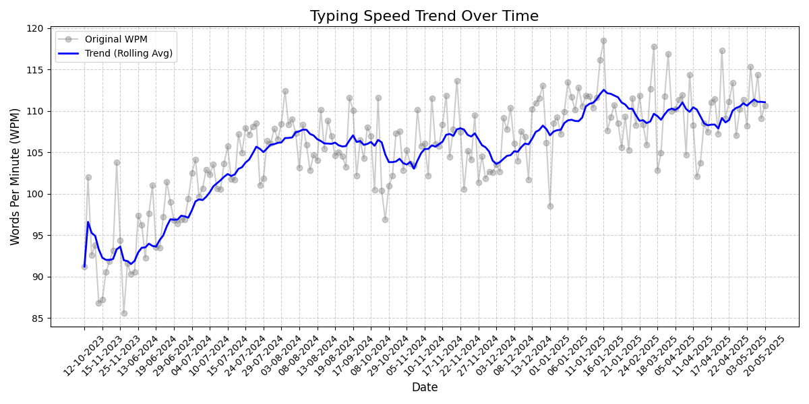
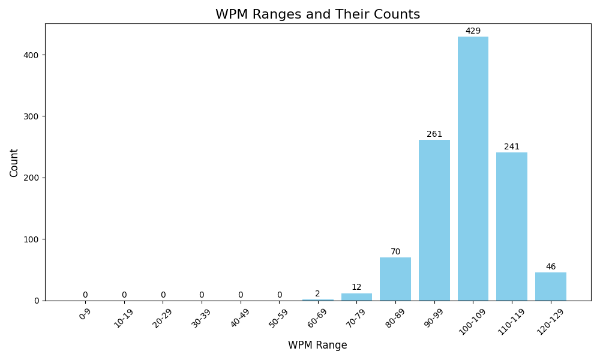

[Configuration](#configuration)
## My public Monkeytype [profile](https://monkeytype.com/profile/zp14)

        
## Typing History Stats (Last Updated: 26/11/2024 18:38)

| **Key Stats**               | **Overall Stats**       | **Last 10 Tests Stats**  |
|--------------------------|-------------------------|--------------------------|
| **Total Entries**        | 970           | 10                       |
| **Average WPM**          | 103.21           | 103.86    |
| **Average Accuracy**     | 90.90%          | 88.82%   |
| **Max WPM**              | 129.13               | 118.37        |
| **Min WPM**              | 64.77               | 86.8                        |
| **Total Duration**       | 08:06:07        | 00:05:00                        |

---

### Last 10 results

| | WPM | Accuracy | Consistency | Mode | Date |
| --- | --- | -------- | ----------- | ---- | --------- |
| 1 | 112.39 | 91.9 | 83.61 | time 30 | 26-11-2024 17:38:16 |
| 2 | 97.97 | 89.25 | 82.95 | time 30 | 26-11-2024 17:37:36 |
| 3 | 118.37 | 95.86 | 87.25 | time 30 | 26-11-2024 17:36:54 |
| 4 | 106.35 | 85.51 | 86.58 | time 30 | 25-11-2024 17:06:27 |
| 5 | 106.39 | 90.46 | 87.15 | time 30 | 25-11-2024 17:04:30 |
| 6 | 109.57 | 87.8 | 87.52 | time 30 | 25-11-2024 17:02:47 |
| 7 | 86.8 | 81.62 | 85.29 | time 30 | 25-11-2024 17:01:09 |
| 8 | 112.37 | 92.05 | 84.77 | time 30 | 25-11-2024 17:00:20 |
| 9 | 94.39 | 86.39 | 83.06 | time 30 | 25-11-2024 16:59:18 |
| 10 | 93.97 | 87.34 | 81.21 | time 30 | 25-11-2024 16:58:41 |

 --- 

### Top 10 results

| | WPM | Accuracy | Consistency | Mode | Date |
| --- | --- | -------- | ----------- | ---- | --------- |
| 1 | 129.13 | 97.93 | 87.46 | time 30 | 20-07-2024 16:54:21 |
| 2 | 126.37 | 99.08 | 86.0 | time 30 | 05-08-2024 14:25:56 |
| 3 | 125.96 | 95.82 | 86.11 | time 30 | 09-08-2024 12:56:13 |
| 4 | 125.55 | 98.18 | 85.59 | time 30 | 09-10-2024 16:32:56 |
| 5 | 124.8 | 98.12 | 86.59 | time 30 | 18-11-2024 15:57:37 |
| 6 | 124.78 | 99.06 | 87.92 | time 30 | 02-11-2024 18:46:45 |
| 7 | 123.58 | 97.23 | 85.1 | time 30 | 21-11-2024 14:06:35 |
| 8 | 123.56 | 97.56 | 87.97 | time 30 | 16-08-2024 16:52:42 |
| 9 | 123.15 | 96.98 | 84.75 | time 30 | 28-06-2024 17:01:24 |
| 10 | 123.14 | 96.95 | 86.04 | time 30 | 20-08-2024 17:01:55 |

 --- 

### Avg data for latest 10 dates

| | Date | Tests | WPM | Acuracy | Consistency |
| --- | --- | -------- | ----------- | ---- | --------- |
| 1 | 2024-11-26 | 3 | 109.58 | 92.34 | 84.6 |
| 2 | 2024-11-25 | 11 | 104.09 | 89.16 | 85.57 |
| 3 | 2024-11-24 | 14 | 105.21 | 90.62 | 83.51 |
| 4 | 2024-11-23 | 11 | 100.5 | 89.28 | 81.84 |
| 5 | 2024-11-22 | 10 | 107.47 | 89.49 | 85.75 |
| 6 | 2024-11-21 | 10 | 113.63 | 93.9 | 85.63 |
| 7 | 2024-11-20 | 10 | 107.74 | 92.24 | 83.67 |
| 8 | 2024-11-19 | 7 | 104.44 | 90.75 | 84.83 |
| 9 | 2024-11-18 | 10 | 111.87 | 93.65 | 84.43 |
| 10 | 2024-11-17 | 7 | 108.33 | 91.29 | 84.57 |

 --- 

### Avg data for top 10 dates (minimum 7 tests)

| | Date | Tests | WPM | Acuracy | Consistency |
| --- | --- | -------- | ----------- | ---- | --------- |
| 1 | 2024-11-21 | 10 | 113.63 | 93.9 | 85.63 |
| 2 | 2024-08-04 | 10 | 112.37 | 94.95 | 82.5 |
| 3 | 2024-11-18 | 10 | 111.87 | 93.65 | 84.43 |
| 4 | 2024-09-16 | 10 | 111.6 | 92.88 | 84.44 |
| 5 | 2024-11-12 | 10 | 111.54 | 93.43 | 85.92 |
| 6 | 2024-08-14 | 10 | 110.12 | 92.96 | 84.29 |
| 7 | 2024-11-08 | 10 | 110.1 | 93.13 | 84.57 |
| 8 | 2024-09-17 | 10 | 110.08 | 93.57 | 82.77 |
| 9 | 2024-08-06 | 10 | 109.02 | 93.69 | 82.79 |
| 10 | 2024-08-16 | 10 | 108.85 | 92.18 | 83.35 |

 --- 

        

# Configuration
1. **Fork this repository** 
2. **Download repository** `git clone https://github.com/YOUR_ACCOUNT_NAME/Monketype-api-import.git`
3. **Login to your account, get API Key from account settings -> ape keys -> generate new key -> check active button next to apekey's name**
4. **Add generated api key to .env file, variable name apikey in your project catalog**  `echo apikey = YOUR_APE_KEY >> .env` in terminal/cmd
5. **Install required modules (preferably in a virtual environment `virtualenv`)** `pip install -r req.txt`
6. **(If you've got less than 1000 tests completed) Run get_data_max_1000.py script that will load data from [Monkeytype](https://monkeytype.com/) and insert into sqllite3 db history.db (this wont be stored on your GitHub)**
7. **Error logs will be stored into logfile.log, and import status will be stored into import_status.log**
8. **stats.py script will get data from db and push them into GitHub account**
9. **You can use API call via ApeKey 30 times per day, so after you reach this limit you wont get any answear and in logfile you will see *Problem with inserting data 0* row**
10. **incremental_import.py will check for the last result time in db and download just those tests that are younger than that. It will also update automatically into GitHub account unless you comment last 2 line of code. You may set execution of this script in CRON/Task scheduler to automatically import data to db and push to your GitHub account.**

# UPDATE for 1000+ tests
    
**As monkeytype API enables just 1000 rows to be downloaded via API call, for proper inintial insertion to db tests where there are more than 1000 on your profile
you should export csv file from [Monkeytype account](https://monkeytype.com/account) (over results at the bottom of the site)
and put this csv file into project folder (or set proper path to this file into variable csv_file), then run inintial_csv_read.py script.**
    